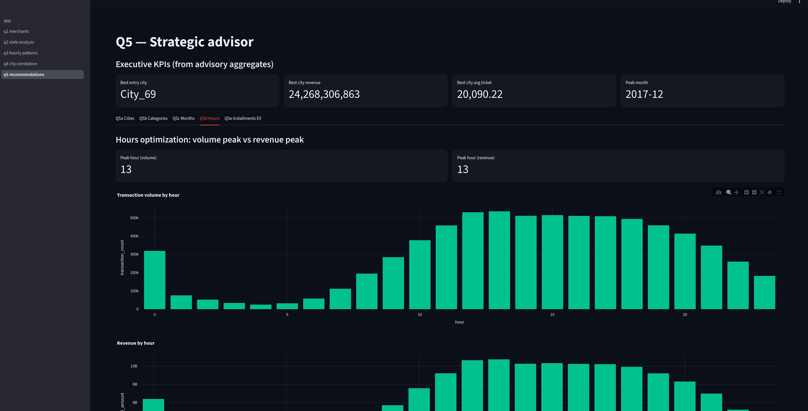
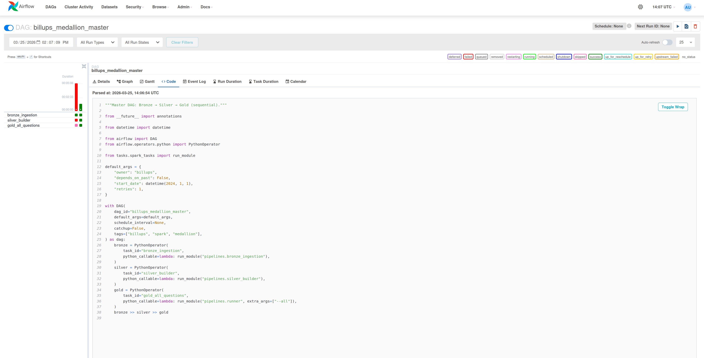

# Billups Data Engineering Challenge

Production-style **Medallion (Bronze → Silver → Gold)** pipelines in **PySpark** with **Delta Lake**, optional **Airflow** orchestration, and a **Streamlit** dashboard.

## Prerequisites

- **Python:** la versión mínima se define en **`pyproject.toml`** (`requires-python`). El script **`scripts/setup.sh`** comprueba tu `python3` (o `PYTHON=/ruta`) antes de crear el venv.
- **JDK** for PySpark (see Java matrix below)

### Instalación automática (recomendado)

```bash
./scripts/setup.sh                      # valida versión, crea venv, pip install
# Primera vez en Ubuntu/Debian sin python3-venv o sin Java:
./scripts/setup.sh --install-system-deps --with-java
```

Equivalente: **`make init`** (llama a `./scripts/setup.sh`). Con paquetes del sistema:  
`make init ARGS='--install-system-deps --with-java'`

Si **`apt-get update`** falla por un repo de terceros (p. ej. `packagecloud.io/ookla/speedtest-cli`), desactiva o elimina ese `.list` en `/etc/apt/sources.list.d/`. El script ya **no aborta** solo por un `update` fallido e intenta `apt-get install` igual.

- Place challenge data under `data/raw/`:
  - **Transactions (Parquet):** preferred layout is a folder `data/raw/historical_transactions/` containing Spark-style files such as `part-00000-tid-*.snappy.parquet` (read the whole directory). Alternatively a single `data/raw/historical_transactions.parquet`, or loose `data/raw/part-*.parquet` files from a download, work without moving files. Columns: `merchant_id`, `amount`, `category`, `purchase_ts`, `city_id`, `state_id`, `installments`.
  - **Merchants:** `merchants.csv` (must include `merchant_id`, `merchant_name`; you can copy `merchants-subset.csv` as `merchants.csv` for local runs)
  - Override path: `RAW_TRANSACTIONS_PATH` → directory or `.parquet` file.

### Dataset notes (naming vs documentation)

The Data Dictionary may refer to `historical_transactions.csv`, while the download is Parquet and files are often named like `part-*.snappy.parquet`. This project reads a **Parquet directory or file** without hardcoding part names—see `docs/ASSUMPTIONS.md`.

### Java ↔ Spark / PySpark (what to install)

| Tu stack | JDK recomendado | Notas |
|----------|-----------------|--------|
| **PySpark 3.5.x** (este repo: `pyspark>=3.5,<3.6`) | **17** (LTS) o **11** (LTS) | Delta 3.3.x va con Spark / PySpark 3.5.x. |
| **Spark 4.x** (otro proyecto) | **17 u 21** | Spark 4 y PySpark 4.x apuntan a JDK más nuevos. |

Recomendación práctica: **OpenJDK 17** y `JAVA_HOME` apuntando al JDK (ver abajo).

#### Instalar Java 17 en Ubuntu (paso a paso)

1. **Actualizar índice de paquetes**
   ```bash
   sudo apt update
   ```
2. **Instalar OpenJDK 17 (cabeceras + JVM)**
   ```bash
   sudo apt install -y openjdk-17-jdk
   ```
3. **Comprobar instalación**
   ```bash
   java -version
   # Debe mostrar "openjdk version 17" (u similar).
   ```
4. **Definir `JAVA_HOME`** (ruta habitual en Ubuntu amd64):
   ```bash
   sudo update-alternatives --config java
   # Anota la ruta del binario java, por ejemplo /usr/lib/jvm/java-17-openjdk-amd64/bin/java
   ```
   ```bash
   echo 'export JAVA_HOME=/usr/lib/jvm/java-17-openjdk-amd64' >> ~/.bashrc
   echo 'export PATH="$JAVA_HOME/bin:$PATH"' >> ~/.bashrc
   source ~/.bashrc
   echo "$JAVA_HOME"
   ```
5. **Verificar que PySpark ve el JDK**
   ```bash
   python3 -c "import shutil, subprocess; print(shutil.which('java'))"
   ```

Si usas **solo Docker** para Airflow/dashboard, el JDK del host no hace falta para esos servicios; **sí lo necesitas** para `make run-all` / PySpark en tu máquina.

### Docker (dashboard + Airflow)

Hay un **`docker-compose.yml`** en la raíz:

| Servicio | Puerto | Descripción |
|----------|--------|-------------|
| `dashboard` | **8501** | Streamlit (imagen ligera en `docker/Dockerfile.dashboard`) |
| `airflow-webserver` | **8080** | UI Airflow (usuario/clave por defecto **admin / admin** solo para dev) |
| `airflow-scheduler` | — | Scheduler |
| `postgres` | — | Metadatos de Airflow |

La imagen de Airflow está en **`docker/Dockerfile.airflow`**: extiende `apache/airflow:2.8.3` e instala **OpenJDK 17** + PySpark/Delta para que los DAGs puedan ejecutar `python -m pipelines.*` dentro del contenedor.

```bash
# Linux: permisos coherentes con volúmenes Airflow
export AIRFLOW_UID=$(id -u)
docker compose up -d --build
# Dashboard: http://localhost:8501
# Airflow:   http://localhost:8080
```

Si ejecutas `docker compose` sin `AIRFLOW_UID` en Linux, el contenedor puede fallar al escribir en `data/bronze|silver|gold` por permisos del bind mount. El `docker-compose.yml` usa `AIRFLOW_UID` cuando está presente (recomendado).

Solo el dashboard: `docker compose up -d dashboard`.

Los DAGs leen/escriben rutas bajo el repo montado en **`/opt/project`** (Airflow) y **`/app`** (Streamlit). Asegúrate de tener **`data/raw`** con los ficheros del challenge antes de lanzar pipelines desde Airflow.

## Screenshots
### Dashboard (Streamlit)


### Airflow (DAGs)


## Quickstart

```bash
python3 -m venv venv && source venv/bin/activate
pip install -r requirements.txt
export PYTHONPATH=.
python3 -m pipelines.bronze_ingestion --env dev
python3 -m pipelines.silver_builder --env dev
python3 -m pipelines.runner --all --env dev
```

## Make targets

| Target        | Action                          |
|---------------|---------------------------------|
| `make test`   | Pytest + coverage               |
| `make lint`   | black, isort, flake8, mypy      |
| `make validate-data` | Data Dictionary.xlsx vs `data/raw` (pandas/pyarrow; no Spark) |
| `make run-all`| Bronze → Silver → Gold Q1–Q5    |
| `make dashboard` | Streamlit UI                 |
| `make docker-up` | `docker compose` (dashboard + Airflow + Postgres) |

## Architecture

- **Bronze**: raw ingest + lineage columns (`pipelines/bronze_ingestion.py`)
- **Silver**: `MerchantResolutionService` (dedupe `merchant_id`) + `CleaningService` (schema alignment + join + category rules) (`pipelines/silver_builder.py`); also writes `merchants_resolved` and `merchants_duplicates_audit` under `data/silver/`
- **Gold**: Q1–Q5 read **Silver only** (`pipelines/runner.py`, `src/application/strategies/`). Q4 is grouped under `data/gold/q4/` (`results`, `city_category_association`, `top_merchants_global`, `top_merchants_distribution_by_city`, `merchant_popularity_by_city`); Q5: `q5_advisory_summary`; report narrative consolidado en `docs/Q5_BUSINESS_REPORT.md` (Q1–Q5).

See `docs/ARCHITECTURE.md`, `docs/ASSUMPTIONS.md` (includes an **evaluator / exam map**), and `docs/RUNBOOK.md` for troubleshooting.

Generate `EXECUTIVE_SUMMARY.pdf` locally from your write-up if the challenge requires a PDF artifact.

---

> Esta solución fue diseñada siguiendo **principios SOLID** y **patrones de diseño**
> (Template Method, Strategy, Repository, Factory, Decorator) para demostrar cómo
> construiría un sistema de datos **mantenible, testeable y escalable** en producción.
>
> La arquitectura sigue el patrón **Medallion (Bronze/Silver/Gold)**, con limpieza
> de datos centralizada en Silver layer para garantizar consistencia y eficiencia.
>
> Incluye orquestación con **Airflow**, visualización con **Streamlit**, y está
> listo para desplegar en **Databricks**.
>
> Porque un Arquitecto de Datos no solo escribe código que funciona,
> sino código que **perdura**.
