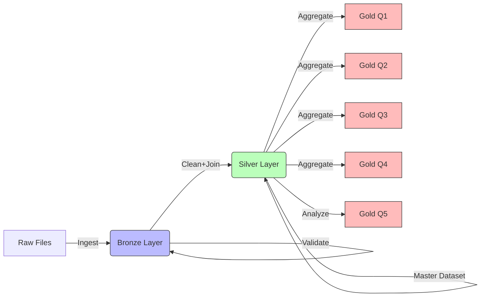

# Architecture

## Medallion flow

## Design patterns

| Pattern | Usage |
|---------|--------|
| Template Method | `BaseSparkPipeline.execute()` |
| Strategy | `Q1Strategy` … `Q5Strategy` |
| Repository | `SilverTableRepository`, `GoldWriter` |
| Factory | `pipelines/factory.build_gold_pipeline` |

## Layer rules

1. **Gold pipelines never read Bronze or Raw** — only `DeltaSilverRepository`.
2. **Silver** (`silver_builder.py`) is the only place that: (a) aligns raw column names to the challenge contract (`CleaningService.align_to_challenge_schema`), (b) resolves duplicate `merchant_id` rows (`MerchantResolutionService`), (c) joins merchants and applies category / name rules (`CleaningService.join_and_clean`). Silver also materializes `merchants_resolved` and `merchants_duplicates_audit` Delta tables for auditability.

## Data ingestion strategy

### File format handling

| Dataset | Docs may say | Typical on disk | Handling |
|---------|----------------|-------------------|----------|
| historical_transactions | CSV | Folder `historical_transactions/` with `part-*.snappy.parquet`, or one `.parquet`, or loose `part-*.parquet` in `data/raw/` | `resolve_raw_transactions_path` → `spark.read.parquet` (path, directory, or glob) |
| merchants | CSV | CSV | `spark.read.csv` with header and inferred schema |

Documentation sometimes lags real pipelines; Spark-written Parquet uses part-file naming by default. Reading a directory or a supported glob instead of a single hardcoded filename is more robust in production.

### Schema alignment (Silver)

Bronze is a faithful ingest; **Silver** renames alternate transaction columns (`purchase_date` → `purchase_ts`, `purchase_amount` → `amount`) so all Gold strategies share one contract (see `docs/ASSUMPTIONS.md`).

## Canonical Data Contract (Silver)

Silver acts as the single source of truth for the “Gold contract” used by all strategies. In practice, this means:
- Column-name normalization (for example: `purchase_date` → `purchase_ts`, `purchase_amount` → `amount`).
- Consistent handling of optional or ambiguous fields (for example, categories that may appear as `Unknown category`).
- Enrichment and joins applied once (and only once) so Gold can stay focused on question-specific aggregations.

This contract-first approach reduces coupling: Gold never needs to know how raw files were shaped or which synonym column names appeared upstream.

## Storage Layout (Delta Lake)

The pipeline follows a Medallion layout under `data/`:
- `data/raw/`: the original challenge files as provided (historical transactions, merchants CSV, etc.).
- `data/bronze/`: Bronze Delta output (faithful ingest plus ingestion/lineage columns).
- `data/silver/`: cleaned and de-duplicated canonical datasets, including audit outputs such as:
  - `merchants_resolved`
  - `merchants_duplicates_audit`
- `data/gold/`: final, analysis-ready outputs grouped by question (for example `data/gold/q4/`, and question-specific folders for Q1–Q5).

Keeping the layers physically separated makes reprocessing safer and allows Gold to be recomputed without touching raw ingest details.

## Execution Flow (Runner + Strategies)

Gold execution is driven by a runner that selects a strategy per question:
- `pipelines/runner.py` orchestrates running Q1–Q5 against the Silver layer.
- Each question strategy (for example `Q1Strategy` … `Q5Strategy`) implements the transformation logic required to produce its Gold outputs.
- A factory (`pipelines/factory.build_gold_pipeline`) builds the appropriate pipeline objects so the system stays consistent even as new questions are added.

The design intentionally keeps Gold pipelines small and composable: they should read from Silver, compute aggregations, and write results to `data/gold/`.

## Data Quality Gates

Because the Medallion model separates responsibilities, quality checks can be placed where they belong:
- Bronze validation: verify ingest feasibility (schema discovery, required columns present, readable input paths).
- Silver validation: enforce the canonical contract. If Silver cannot align/clean/resolve as expected, downstream Gold computations should not proceed.
- Dedupe auditability: resolving duplicate `merchant_id` rows is accompanied by audit tables (`merchants_duplicates_audit`) so data issues remain observable.
- Gold validation (recommended): sanity checks on output sizes and key metric ranges (for example, empty results, unexpected skew, or missing categories).

These gates reduce the risk of silently producing misleading business insights.

## Error Handling and Failure Isolation

The pipeline is designed so failures are easier to locate:
- Contract issues should fail early in Silver (where schema alignment happens).
- Gold should be resilient to question-specific logic errors by isolating each question strategy’s execution and output.
- Re-runs should be possible without manual cleanup by keeping writes layer-scoped and deterministic.

If you need additional resilience, the natural extension point is to wrap strategy execution with a consistent retry/logging decorator (without changing the core transformations).

## Orchestration Options

The repo supports two common execution modes:
- Local / script-based runs: use `make run-all` or run the runner/individual entry points directly.
- Airflow orchestration (optional): a scheduler/webserver setup can run the same Bronze → Silver → Gold steps as a DAG, with the code inside the pipelines executed in containerized environments (when using Docker Compose).

In both modes, the Medallion ordering is preserved to keep dependencies explicit.

## Observability and Auditability

Auditability comes from two complementary mechanisms:
- Lineage-friendly Bronze ingest: Bronze keeps ingestion metadata so you can trace where records came from.
- Silver audit outputs: duplicate resolution produces auditable Delta tables such as `merchants_duplicates_audit`.

Together, they enable both “debugging the data” (what happened and why) and “debugging the code” (which stage produced incorrect results).

## Performance and Scalability Considerations

For production-grade scaling, the main considerations are:
- Read robustness: when handling Parquet, prefer reading directories/globs rather than hardcoding single filenames (reduces small-file brittleness).
- Partitioning opportunities: consider partitioning Silver/Gold by time-related columns (for example `purchase_ts` month) and/or common query dimensions (city/state) to speed up aggregations.
- Avoid repeated work: compute canonical joins and deduplication only in Silver so Gold strategies can focus on aggregation.
- Favor column pruning: ensure transformations select only the columns required by each strategy.

These guidelines keep runtime predictable as the dataset grows.

## Extensibility

To add new analysis questions (new Gold outputs) you typically:
- Implement a new strategy class (mirroring the Q1–Q5 pattern).
- Register it in the factory so the runner can build the correct pipeline.
- Keep all raw-to-contract logic inside Silver (new Gold strategies should not reintroduce raw ingestion knowledge).

This preserves the core contract: Bronze is ingest, Silver is cleaning and normalization, Gold is question-specific aggregation.
